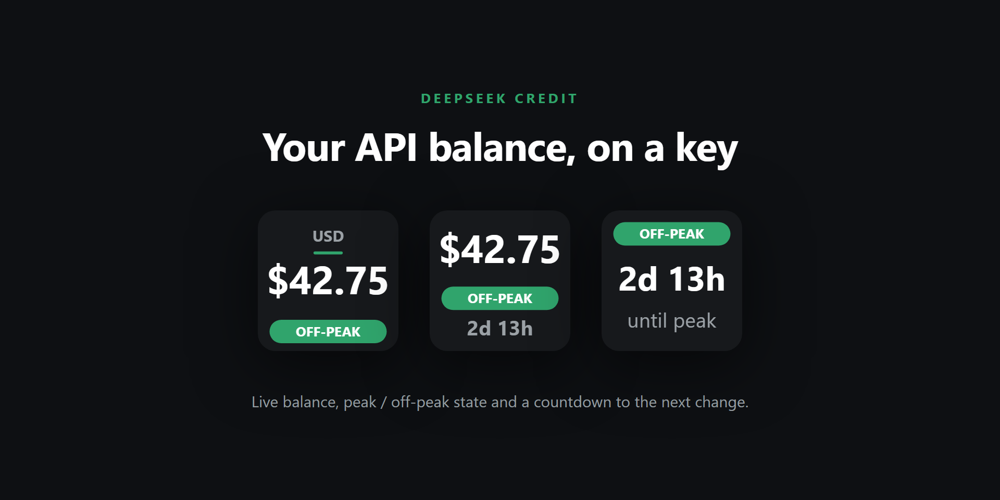
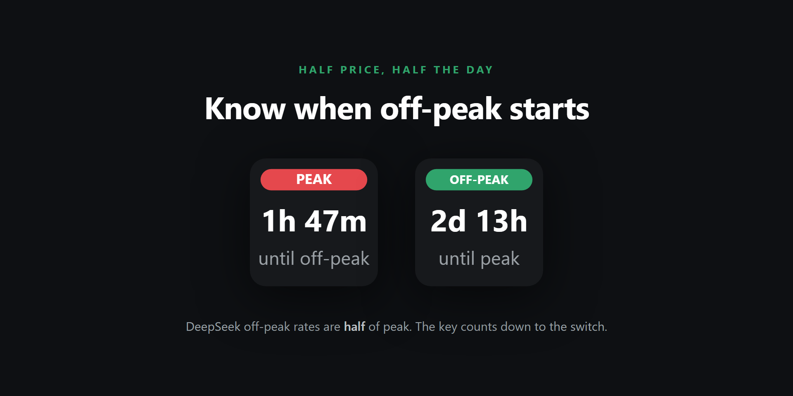

# DeepSeek Credit — Stream Deck plugin

A Windows Stream Deck plugin that shows, at a glance, how much DeepSeek API credit you have left and whether
DeepSeek is charging **peak** or **off-peak** rates right now. Off-peak rates are half the peak rates, so the
key tells you both *how much* you can spend and whether now is a *cheap time* to spend it.

## What the keys show

Add the **DeepSeek Credit** action to a key, then choose what it shows in its settings:

- **Credit balance**: the currency and total balance DeepSeek reports, with a PEAK / OFF-PEAK bar underneath.
  If DeepSeek says the balance is not enough for API calls, the amount turns red and says INSUFFICIENT.
- **Peak / off-peak**: the current state and a countdown to the next change, for example `2h 14m` or `2d 15h`.

The balance refreshes every 5 minutes, when you change the API key, and when you press the key. Several keys
share one request. The peak state and countdown update every minute and never call the API.

If the balance can't be shown, the key says why: `Set API key`, `Invalid API key`, `HTTP error <status>`,
`Timed out`, `Network error` or `Unexpected response`. It never shows a made-up amount.

## Setting your API key

1. Create an API key at <https://platform.deepseek.com/api_keys>.
2. In the Stream Deck app, select a DeepSeek Credit key and paste the key into **API key**.

You only enter it once: it applies to every DeepSeek Credit key and takes effect straight away.

**Where it's stored:** in Stream Deck's plugin settings on this PC (the plugin's *global settings*), not in
Windows Credential Manager or another keychain. The plugin never writes the key to its log files.

## Peak hours

From DeepSeek's [pricing page](https://api-docs.deepseek.com/quick_start/pricing/) (checked 2026-09-17):
peak hours are **01:00–04:00 and 06:00–10:00 UTC, Monday to Friday**. All other times, including weekends,
are off-peak. The plugin works this out from the PC's clock, so your time zone doesn't matter.

DeepSeek has changed its pricing before. If the hours change, edit the schedule at the top of
[`src/peak.ts`](src/peak.ts) and rebuild.

## Installing

Build the package (see below), then double-click `dist/io.github.alexschwantes.deepseek-credit.streamDeckPlugin` on the
Windows PC to install it into Stream Deck.

## Development

Requires Node.js 22.18 or later (the tests run TypeScript directly with `node --test`).

| Command | What it does |
|---------|--------------|
| `npm install` | Install dependencies |
| `npm run build` | Build `src/` into `io.github.alexschwantes.deepseek-credit.sdPlugin/bin/` |
| `npm run watch` | Rebuild on change, then reload the plugin in Stream Deck |
| `npm run reload` | Set up Stream Deck if needed, then reload the plugin once |
| `npm run typecheck` | Type-check source and tests (the build does not fail on type errors) |
| `npm test` | Run the automated tests (no Stream Deck or network needed) |
| `npm run validate` | Build, then validate the plugin with the Stream Deck CLI |
| `npm run pack` | Build, then package to `dist/io.github.alexschwantes.deepseek-credit.streamDeckPlugin` |

### Running from source

`npm run watch` and `npm run reload` both go through [`scripts/reload.mjs`](scripts/reload.mjs), which sets
Stream Deck up on first run. Expect to restart Stream Deck twice, once for each setup step it reports:

1. **Developer mode.** Stream Deck ignores plugin reloads and linked plugins unless it is on. The script turns
   it on (`npx streamdeck dev`, which sets `developer_mode` under
   `HKCU\Software\Elgato Systems GmbH\StreamDeck`; undo with `npx streamdeck dev -d`).
2. **Linking.** The script links this folder into Stream Deck's plugin folder, so a build is picked up without
   copying anything.

After that, `npm run watch` rebuilds and reloads on every save.

Two Stream Deck behaviours are worth knowing, because both fail silently and look like a broken build:

- `streamdeck restart` only opens `streamdeck://plugins/restart/<uuid>` and reports success whether or not
  Stream Deck acts on it. With developer mode off it does nothing at all. The script kills the plugin's node
  process instead, and Stream Deck relaunches it.
- A plugin installed from a `.streamDeckPlugin` file is a *copy*, so builds in this repo never reach it. The
  script refuses to run against a copied install rather than reloading stale code.

| File | Purpose |
|------|---------|
| `src/peak.ts` | Peak schedule, peak state, next change, countdown text |
| `src/balance.ts` | Calls DeepSeek's balance API and classifies the result |
| `src/balance-store.ts` | Shared API key, cached balance and refresh rules |
| `src/render.ts` | Key faces (SVG) |
| `src/actions/deepseek-credit.ts` | The Stream Deck action: events, per-minute redraw |
| `io.github.alexschwantes.deepseek-credit.sdPlugin/` | Manifest, settings panel (`ui/`) and images |

`io.github.alexschwantes.deepseek-credit` is the plugin UUID. It can't change after a Marketplace
release, and the `.sdPlugin` folder name has to match it.
